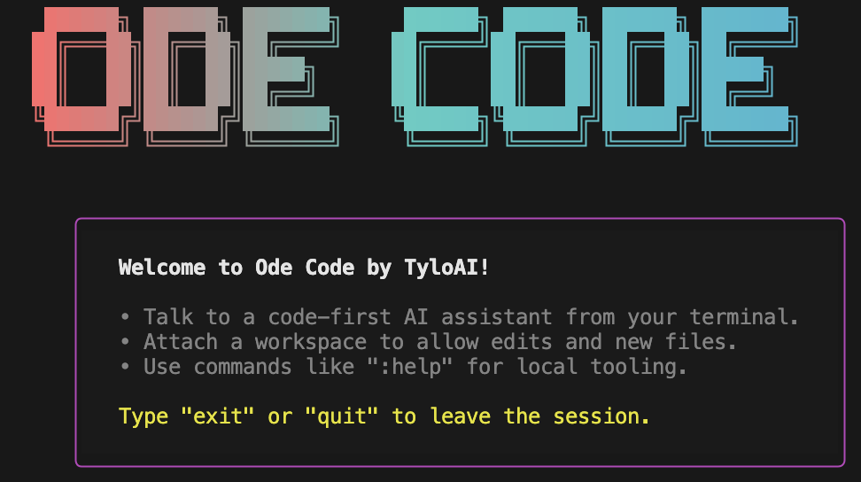

<p align="center">
  <h1 align="center">TyloAI ode-code CLI</h1>
</p>

<p align="center">
  <a href="https://www.npmjs.com/package/@tyloai/ode-code"></a>
  <a href="LICENSE"></a>
  <a href="https://tyloai.com/new"></a>
</p>

<p align="center">
  <code>npm install -g @tyloai/ode-code</code>
</p>

<p align="center">
  <strong>ode-code</strong> is a coding agent from TyloAI that runs locally on your computer.
  <br />
  <br />
  If you are looking for the <em>ode-code</em> on <strong>Web</strong>, go to <a href="https://tyloai.com/new">tyloai.com</a>
</p>

<p align="center">
  
</p>

---

## What is ode-code?

`ode-code` (TyloAI ode-code CLI) is an intelligent terminal-based programming assistant.

It works like a pair programmer and runs directly in your local development environment. `ode-code` can read, create, and modify your files and folders, allowing you to complete code generation, refactoring, and debugging tasks through natural language prompts.

## Features

* **Intelligent Interaction:** Launch an interactive chat session with `ode code`.
* **File Operations:** Directly read, create, or modify your local files.
* **Code Generation:** "Help me create a new React component named 'UserProfile'..."
* **Code Refactoring:** "Refactor this function to make it more concise..."
* **Bug Fixing:** "There's a bug in this code; help me analyze it..."
* **Git Integration (Coming Soon):** Automatically help you commit code or create PRs (Pull Requests).

## Quickstart

Get started with `ode-code` in 30 seconds.

### 1. Installation

Install globally using `npm` (or your preferred package manager):

```shell
npm install -g @tyloai/ode-code
```

### 2. Start Coding!

You can start using it now!

**Launch an interactive session:**

```shell
ode code
```
**Or**
```
tyloai
```
**Then, select a mode:**
You can choose from the following three modes and set your workspace:
* **Use current directory:** Directly use the current directory as your workspace; your current directory will be displayed.
* **Use a specific directory:** Manually enter a directory path to set it as your workspace.
* **Read-only mode:** The model can read files but cannot edit them.

**That's it! You can now start your coding journey!**
Please note that each user can use 50 free sessions per day. For more restrictions, please read our **[https://docs.tyloai.com/code](https://docs.tyloai.com/code)** document first.

## 📄 License

This project is licensed under the [Apache-2.0 License](LICENSE.md).

-----

<p align="center">
<small>Made with ❤️ by <strong>TyloAI</strong></small>
</p>
